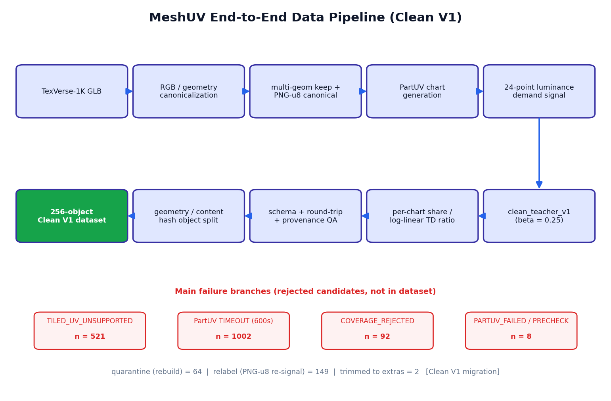
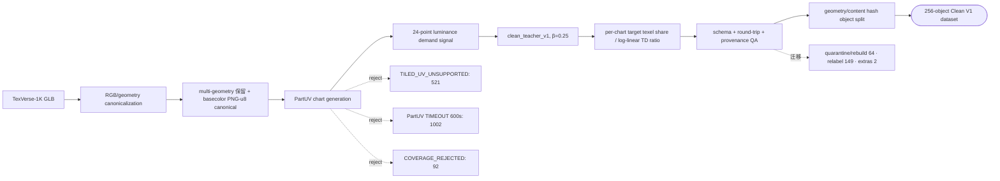
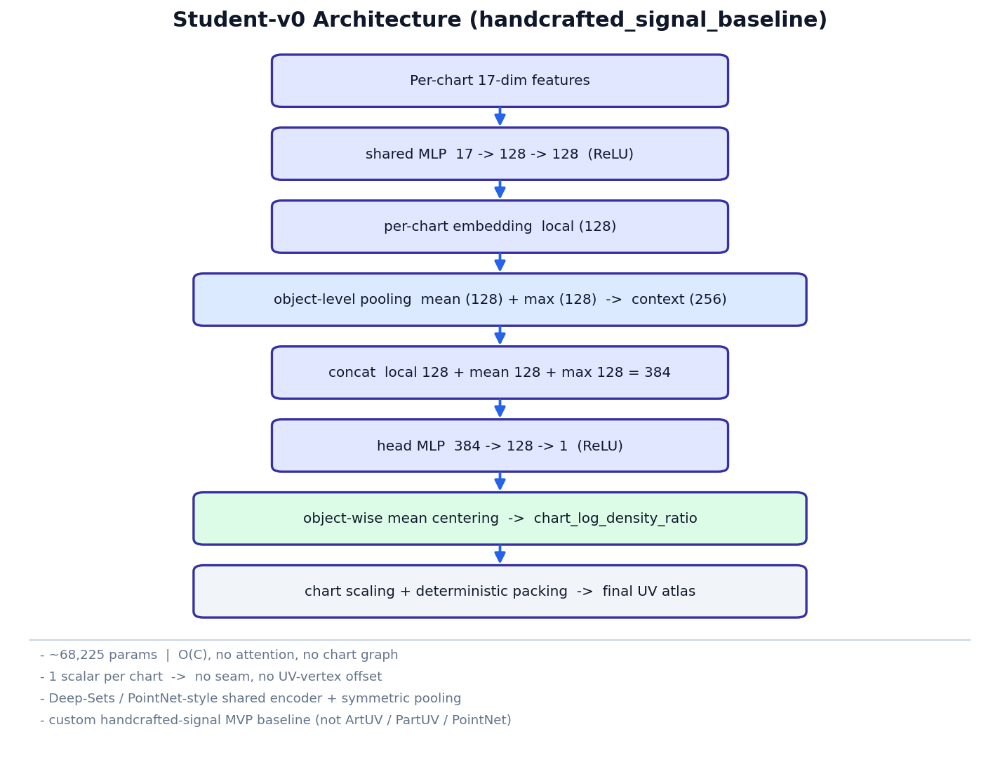
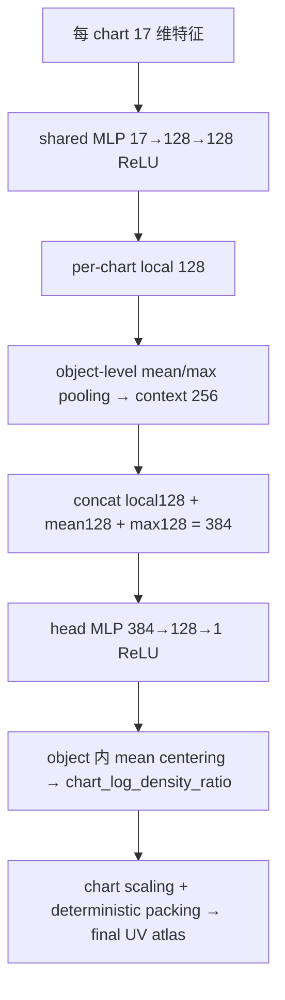
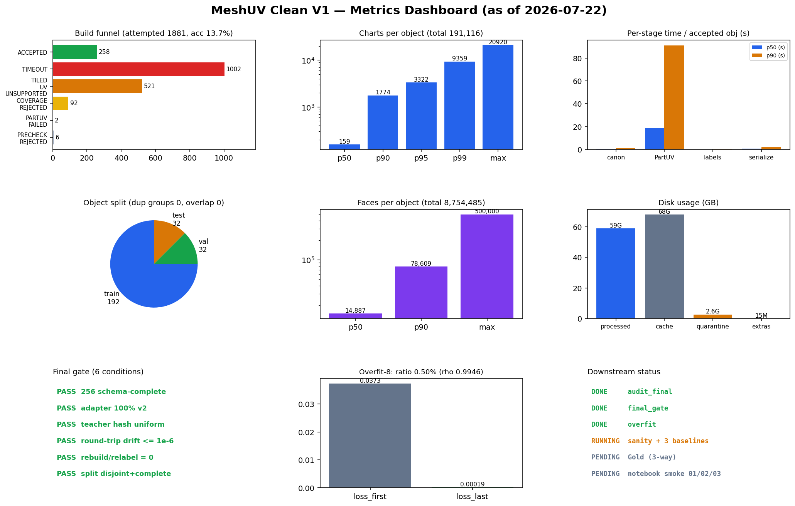

# MeshUV 项目阶段汇报（面向 Leader）

> 生成时间：**2026-07-22**，数字均来自生成时的真实磁盘状态（JSON / manifest / checkpoint / 日志 / 代码），未完成结果标记 **PENDING / IN PROGRESS**。
> 代码版本：`main` @ `28b3201`（完整 `28b32010f7f6403540609f6da3ef1ec4abc3b342`）　Teacher 冻结哈希：`40cd6182f6981fbc`　仓库：https://github.com/yia-zhang/PartUV

## 一句话三连（30 秒）

1. **要解决的问题**：在**固定 texel budget** 下，把更多纹素分配给**纹理信息需求高**的 mesh 区域（信息多的地方给更高纹理密度）。
2. **当前 MVP**：**PartUV** 提供可替换的 chart baseline → **clean Teacher** 产出 allocation pseudo-GT → **Student** 学习每个 chart 的**相对线性纹理密度**。
3. **当前边界**：只研究 **basecolor / RGB + chart allocation**；**不预测 seam**、**不直接预测每个 UV 顶点**、**不等同于完整 ArtUV parameterization**。

---

## 二、端到端数据 Pipeline

GitHub 可渲染 Mermaid 源码：

---

## 三、Student-v0 模型结构

- 参数量 **68,225**；**O(C)**，无 attention、无 chart graph。
- 输出**每 chart 一个标量**，**不输出 seam、不输出 UV vertex offset**。
- 属于**自定义 handcrafted-signal MVP baseline**；形式上类似 Deep Sets / PointNet 的 shared encoder + symmetric pooling，但**不是** ArtUV / PartUV / PointNet 的直接复现。

---

## 四、输入特征表（17 维）

| 特征 | 维度 |
|---|---|
| log 3D surface-area fraction | 1 |
| log baseline UV-area fraction | 1 |
| log face count | 1 |
| normalized centroid | 3 |
| mean normal | 3 |
| RGB mean | 3 |
| RGB std | 3 |
| 8-sample luminance variation（mean / max） | 2 |
| **合计** | **17** |

> ⚠️ **已知局限**：Teacher 使用 **24-point** luminance std，Student 使用相似的 **8-point** 原始纹理统计，因此 Student-v0 **可能主要在学习 Teacher 的 analytic proxy（shortcut）**。这正是设置 **geometry-only / analytic-proxy / RGB-shuffle** 三个消融基线的原因——用于验证 Student 是否只是复述解析代理。

---

## 五、数据规模与质量 Dashboard

| 指标 | 值 | 来源 |
|---|---|---|
| ACCEPTED / schema-complete | **256 / schema_bad 0** | audit_clean_256.json |
| train / val / test | **192 / 32 / 32** | splits.json |
| duplicate group / split overlap | **0 / 0** | splits.json · final_gate |
| 总 face 数 | **8,754,485**（P50 14,887 · P90 78,609 · max 500,000） | manifest 重算 |
| 总 chart 数 | **191,116**（P50 159 · P90 1774 · P95 3322 · max 20920） | audit |
| basecolor canonical atlas | 主频 **1028×1028**（183/256），多贴图对象按 shelf 变高 | manifest 重算 |
| multi-geometry 对象比例 | **99/256 = 38.7%** | manifest 重算 |
| factor≠1 / 纯色无UV / 有纹理无UV | 12 / 2 / 0 | audit |
| uv_oob / uv_tile_shift / uv_cross_tile | 4 / 4 / 0 | audit |
| 磁盘：processed / cache / quarantine / extras | **59G / 68G / 2.6G / 15M** | du -sh |
| Teacher 分布 | 100% `clean_teacher_v1|40cd6182f6981fbc|luminance_std_png_u8_v1` | audit |
| adapter 分布 | 100% `canonicalizer_rgb_v2` | audit |
| PNG round-trip drift | **max 0.0 · relabel 0** | audit |
| final gate 六项 | **✅ 全 PASS** | final_gate.json |

**Final gate 六条件明细：**

| 条件 | 结果 | detail |
|---|---|---|
| 256 ACCEPTED & schema complete | ✅ PASS | `accepted=256 schema_bad=0` |
| adapter 100% canonicalizer_rgb_v2 | ✅ PASS | `{'canonicalizer_rgb_v2': 256}` |
| Teacher/signal/code hash 100% 一致 | ✅ PASS | `expect=clean_teacher_v1|40cd6182f6981fbc|luminance_std_png_u8_v1 got={'clean_teacher_v1|40cd6182f6981fbc|luminance_std_png_u8_v1': 256}` |
| PNG round-trip drift ≤ 1e-6 | ✅ PASS | `max=0.00e+00` |
| rebuild/relabel 候选 = 0 | ✅ PASS | `rebuild=0 relabel=0` |
| split 无重叠且并集完整 | ✅ PASS | `overlap=0 union=256/256 sizes=[192, 32, 32]` |

---

## 六、数据生产效率与失败漏斗

| 项 | 值 | 来源 |
|---|---|---|
| attempted（累计） | **1,881** | summary.json |
| accepted（构建）→ 冻结 | **258 → 256**（超额 2 移入 extras_beyond_256） | summary · audit |
| acceptance rate | **13.7%** | summary |
| TIMEOUT / TILED / COVERAGE / PARTUV_FAILED / PRECHECK | 1002 / 521 / 92 / 2 / 6 | summary |
| timeout 设置 / worker | **600 s / 4 workers** | build_dataset.py |

**各阶段耗时（秒，仅 accepted 对象；来源 audit timings）：**

| 阶段 | P50 | P90 |
|---|---|---|
| canonicalize | 0.3 | 1.2 |
| **baseline_charts (PartUV)** | **18.4** | **91.0** |
| labels | 0.1 | 0.3 |
| serialize | 0.5 | 2.4 |

- **PartUV 正常对象典型耗时**：P50 ≈ 18.4 s（一个 accepted 样例总耗时约 30 s，PartUV 占绝大部分）。
- **困难对象长尾**：**1002** 个对象跑到 **600 s** timeout 被丢弃——**这是最大的拒绝桶，也是当前主要瓶颈**。
- **标签计算本身极廉价**：P50 ≈ 0.1 s（可忽略）。
- ⚠️ `summary.json` 的 `wall_hours = 1.25` 为**单次会话字段**；本数据集跨多次容器重启续跑，**真实累计 wall time 高于此值**，故效率外推不基于该字段，而基于上表 per-object 阶段耗时与 timeout 分布。

---

## 七、规模扩展对比 —— ⚠️ 全部为 EXTRAPOLATION（非实测）

**共同假设**：acceptance rate = **13.7%**（实测）；每 accepted 对象 processed 存储 ≈ **236 MB**（实测 59G/256）。
- **Current 情景**：均值 ≈ **337 s / 尝试**（约 53% 对象命中 600 s timeout 拉高均值）、**4 workers**。
- **Optimized 情景**：预筛掉超大/tiled 网格 + timeout 降到 120 s + **16 workers** + acceptance 提到 **20%** → 均值 ≈ **52 s / 尝试**。

| 目标规模 | 预计尝试数（Cur / Opt） | 预计 wall（小时，Cur / Opt） | 预计 processed 存储（GB，Cur / Opt） |
|---|---|---|---|
| 256 | 1,868 / 1,280 | 43.7 / 1.2 | 59.0 / 59.0 |
| 1,000 | 7,299 / 5,000 | 170.8 / 4.5 | 230.5 / 230.5 |
| 10,000 | 72,992 / 50,000 | 1708.2 / 45.1 | 2304.7 / 2304.7 |
| 100,000 | 729,927 / 500,000 | 17082.3 / 451.4 | 23046.9 / 23046.9 |

> 结论：**存储线性膨胀**（100K ≈ 23 TB processed，未含 cache），**Current 配置在 10K 以上 wall time 不可接受**；扩规模前必须先做 PartUV 预筛 + timeout 收紧 + 并发扩大。以上数字均为**外推**，仅供规划，不作为实测结果。

---

## 八、训练与评测结果（截至 2026-07-22）

| 环节 | 状态 / 关键数字 | 来源 |
|---|---|---|
| **Teacher** | clean_teacher_v1 · β=0.25 · signal `luminance_std_png_u8_v1` · round-trip drift **0.0** | clean_teacher_v1.yaml · audit |
| **Overfit-8** | 初始 0.03730 → 最终 0.00019，ratio **0.50%**，**✅ PASS**（Spearman 0.9946） | overfit_8.json |
| **Sanity（256）** | **PENDING**（IN PROGRESS：steps 6000 · lr 2e-3 · batch_objects 8 · cosine · d 128 · seed 3；splits 192/32/32） | sanity_256.json |
| **Baselines**（full / geometry-only / analytic-proxy / RGB-shuffle） | **PENDING** | sanity_256.json |
| **Gold（Uniform / Teacher / Student 同预算 MSE·PSNR·HF）** | **PENDING** | gold_closeout.json |
| **Notebook 01 / 02 / 03 smoke** | 01 PASS (4.7s) · 02 PASS (12.0s) · 03 WAITING_CHECKPOINT（03 待 checkpoint） | notebook_runs |

**结果口径必须区分（重要）：**
- **Overfit PASS 只证明训练闭环可学习**，**不等于泛化成功**。
- **Sanity 指标**回答的是：Student 在 held-out 对象上**能否预测 Teacher**。
- **Gold** 才回答：Student 的 UV 在**固定预算**下是否带来**真实纹理收益**（对比 Uniform / Teacher）。

> 🔄 本表与三张图由 `scripts/build_leader_update.py` 生成；sanity / Gold 完成后**重跑该脚本一条命令即可刷新**表与图，无需重写整份报告。

---

## 九、研究定位对比

| 模块 | 角色 | 是否本研究贡献候选 |
|---|---|---|
| **PartUV** | chart / seam baseline（**可替换模块**） | 否（外部 baseline） |
| **clean Teacher** | 固定预算下生成 per-chart allocation pseudo-GT | 支撑 |
| **Student-v0** | 学习 per-chart allocation | **是（texel-budget scheduling）** |
| **ArtUV** | chart **内** UV vertex parameterization | 否（不同问题） |
| **SeamGen / 同学 seam 模块** | seam / chart segmentation | 否（上游） |

> 本研究的贡献候选是 **texel-budget scheduling（纹素预算调度）**，**不是 seam generation**；PartUV 仅作可替换的 chart 来源。

---

## 十、结论、风险与下一步

**✅ 已完成且有证据：** 256 对象 Clean V1 数据集冻结（schema 全通过、adapter/Teacher/signal/code hash 100% 一致、**PNG round-trip drift = 0**、**final gate 六条件全 PASS**、split 192/32/32 零重叠零重复组）；Teacher 定义冻结；**overfit PASS（ratio 0.50%）**；Notebook 01/02 只读全 cell PASS。

**▶️ 正在运行：** sanity 训练（256，含 3 消融基线）→ Gold 三方评测 → Notebook 03 + smoke。

**❌ 尚未证明：** Student 对 Teacher 的**泛化**（待 sanity）；Student UV 的**真实纹理收益**（待 Gold）；**超出 256 的规模泛化**。

**风险：**
1. Student 的 **8-point signal 可能成为 Teacher 的 shortcut**（与 24-point 高度相关）→ 靠三消融基线证伪。
2. **256 数据只验证小范围泛化**，不足以支撑规模结论。
3. **当前仅 basecolor**（未含 normal / roughness / metallic 等）。
4. **Tiled UV 暂不支持**（521 个被拒）。
5. **PartUV timeout 长尾**（1002 个 600 s 超时）限制大规模数据生成。
6. **Student-v0 不是 ArtUV-style parameterization model**（不产出 UV 顶点）。

**下一步：**
- **P0**：完成 sanity / Gold / Notebook 03 与最终验收。
- **P1**：冻结 MVP，扩到 **1K** 并验证泛化。
- **P2**：Student-v1，引入 per-face / mesh encoder、chart adjacency / global budget constraint。
- **可选分支**：若 leader 需要 **ArtUV-like 输出**，需新增 **per-UV-vertex offset 监督**与参数化网络——**当前 allocation-only 数据不能直接当作 ArtUV 训练数据**。

---

## 十一、Leader 汇报页（我应该怎么讲，~5 分钟）

1. **为什么做**：贴图预算是固定的；均匀铺纹素会浪费在平坦区、饿死高频细节区。我们要让模型**学会把纹素预算分给最需要的地方**。
2. **我们完成了什么**：搭好可运行闭环——PartUV 出 chart，冻结的 clean Teacher 出 allocation 标签，Student 学习每 chart 的相对纹理密度；**256 对象数据集已冻结并通过六条硬闸门，训练闭环 overfit 已验证可学习**。
3. **当前最重要的数字**：**256** 对象 / **191,116** charts / **8,754,485** faces；数据质量 **round-trip drift = 0、六闸门全过**；overfit ratio **0.50%**；sanity / Gold **进行中**。
4. **模型究竟是什么**：**68,225** 参数的轻量 O(C) 网络（shared MLP + mean/max pooling），**每 chart 输出一个密度标量**——**不是** ArtUV，不产 seam、不产 UV 顶点。
5. **已证明 vs 未证明**：已证明——数据正确性 + 训练可学习；**未证明**——对 Teacher 的泛化（sanity）、真实纹理收益（Gold）、大规模泛化。
6. **需要 leader 确认的方向**：(a) MVP 目标是**继续 allocation-only** 还是要走向 **ArtUV-like per-vertex 输出**？(b) 是否批准**扩到 1K**（需先投入 PartUV 预筛 + 并发优化以压 timeout 长尾）？(c) 是否需要**扩展到 basecolor 以外的通道**？

---

*所有指标均带来源路径；measured 与 extrapolated 已明确区分；报告文件不含服务器绝对路径 / 凭证 / 个人信息；不提交数据集 / cache / quarantine / 大 checkpoint。原始数字见 `metrics_snapshot.json`。本报告描述的代码/数据状态为 `main` @ `28b3201`（Teacher `40cd6182f6981fbc`）；报告文件本身作为独立文档提交于其后，不改动代码或数据。*
