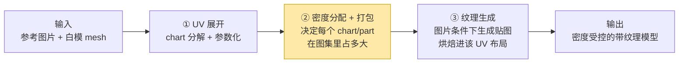

# 01 · 研究任务梳理：leader 到底让我做什么

> Leader 的原话需求：**「输入一张图片和白模，然后需要在这个白模上输出正确的纹理，
> 然后这个纹理是满足纹理密度控制的。」**
> 你的概括：本质是 **"基于纹理密度的 UV mapping 研究"**。
> 本文把这句话拆成可执行的模块，并标出每个模块的现状、归属和研究增量在哪。

---

## 1. 需求拆解：一句话里有三个系统

"图片 + 白模 → 密度受控的正确纹理"是一条完整管线，拆开是三段：

| 段 | 做什么 | 现状 | 是不是我们的研究点 |
|---|---|---|---|
| ① UV 展开 | 把白模切成低失真、数量少、语义对齐的 chart | **PartUV（SIGGRAPH Asia 2025）基本解决**：chart 数量比 Blender/xatlas 少一个数量级、失真有界（τ=1.25）、part 对齐、AI 网格鲁棒 | 不是主战场，是**地基**。PartUV 对 AI 生成网格的鲁棒性恰好匹配 Meshy 的输入 |
| ② 密度分配 + 打包 | 决定像素预算怎么分：均匀（uniform TD）还是按内容/语义加权（content-aware TD） | 业界工具只有"测量 + 手动设为均匀"（Blender Average Islands Scale、TexTools、UVPackmaster 等）；**自动的、内容/语义感知的分配没有现成方案**。PartUV 论文自己也只说"与任意 packer 兼容"，把这层留白了 | **是。这就是研究增量所在** |
| ③ 纹理生成 | 图片条件下给白模生成纹理（多视角扩散 + 烘焙，或 UV 空间生成） | 成熟方向（TEXTure/Text2Tex/Paint3D/Hunyuan3D-Paint…；组内 UniTEX 方向也在此），Meshy 有产品级管线 | 不是我们要重造的；但它是**密度控制价值的兑现场**——生成器的输出精度落在哪，由②的布局决定 |

所以你的概括是对的，还可以更精确一步：

> **课题 = 在 part-based UV 展开（PartUV 这类）的基础上，把"纹理密度"从
> 事后度量升级为 UV 布局阶段的一等公民优化目标；参考图片既是③的生成条件，
> 也（可能）是②的密度需求来源。**

## 2. "纹理密度控制"的三个层级（建议向 leader 确认到哪一层）

| 层级 | 含义 | 类比 | 难度/现状 |
|---|---|---|---|
| **L1 均匀密度** | 全模型 TD 一致（UV 面积 ∝ 3D 面积），消灭附图 BAD 那种忽大忽小 | 自然地理等积地图 | 工程问题。xatlas 近等距展开 + 等比缩放打包基本给到（你 `whitemodel.py` gamma=0 实测 CV≈0.05）；PartUV 失真有界 τ=1.25 意味着 chart 内 TD 波动 ≤ ~25% |
| **L2 内容/语义感知密度** | 细节多的 part 拿更多纹素（脸、logo、机械细节 > 大平面） | 人口 cartogram | **研究增量**。需求信号从哪来（参考图？几何？语义先验？）是核心设计问题 |
| **L3 用户可控密度** | 美术按 part 指定 TD 预算（hero part 10.24 px/cm，隐藏面 2.56），系统满足并保持其余部分和谐 | 行政规划 | L2 的接口化。part-based 分解让"按 part 指定"第一次变得自然可交互 |
| | | | |

三层是递进关系：L1 是 baseline 和验收底线，L2 是论文创新点，L3 是产品价值
（也最贴合你说的"PartUV 对 artist 友好可能是 leader 初心"——**part 是美术
能理解、能指定预算的单位，face/chart 不是**）。

## 3. 与你已有工作的衔接（不是从零开始）

你在 `/root/youjiaZhang/纹理密度/` 已经把**方法层的可行性**验证了一轮
（当时的展开底座是 xatlas / 美术 UV）：

| 已有资产 | 结论 | 在新课题里的角色 |
|---|---|---|
| Exp01 uniform island scale | 均匀化可行，CV 显著下降 | L1 baseline 实现 |
| Exp02/03 content island / face-level | face-level 翘曲角度失真代价大（max_anisotropy 161） | 支持"**刚性 chart 缩放为主，不做连续翘曲**"的设计决策 |
| Exp04 bounded ARAP pareto | 给出内容匹配 vs 失真的 pareto 上界 | 论文里的 ablation / upper bound |
| Exp05 chart split | 推荐主方法：需求不均时切 chart 再分别缩放 | 对应到 PartUV 语境 = **调 τ 或按密度需求细分 part** |
| relayout.py（A→B 修复管线） | 验收优先序：可用性 > 密度 > 内容 > 稳定 rebake > 极限匹配误差 | 验证 harness / oracle（见 03 文档：rebake 不增加信息，产品价值在白模场景） |
| whitemodel.py（白模管线） | gamma=0 uniform PASS；gamma>0 content-aware 按 demand 缩放 chart + MaxRects 重打包；TD 绝对锚定→推荐分辨率 | **就是②的雏形**，差的是：展开底座换成 part-based、需求信号从"贴图 oracle"换成"参考图片预测" |

一句话：**已有工作证明了"密度分配层"本身可行；新课题是把它架到 PartUV 的
part 结构上，并把需求信号从事后 oracle 换成生成前可得的输入（参考图/几何/语义）。**

## 4. 关键的时序问题（chicken-and-egg，必须想清楚）

密度控制要在**生成纹理之前**完成（UV 布局定了生成器才知道往哪画），
但"哪里细节多"最直接的证据是**生成之后的纹理**。四条出路：

1. **几何驱动**：曲率/特征密度/法线变化率高的 part 通常纹理细节也多——
   白模上直接可算，零依赖；
2. **语义驱动**：类别先验（脸/手 > 躯干 > 底面），PartField 特征本身可能就能分类，
   套用业界惯例倍率（面部 2–3×，见 02 文档）；
3. **两遍法**：先均匀布局粗生成 → 在表面上实测内容密度 → 重排布局 → 精生成/重烘焙。
   工程可行、无信息损失（第二遍是重新生成而非 rebake），代价是两倍生成开销——
   这是不训练任何模型就能把参考图内容接进密度分配的干净路径；
4. ~~参考图预测（TDF）~~：**✅ 已决策（2026-07-13，06 文档）本课题不依赖 TDF**
   （`/root/youjiaZhang/UniTEX/` 的 TDF 项目与 `whitemodel.py` 注释里的
   "production: predicted via TDF" 设想保留为日后可选插件，不作为依赖或分工前提）。

组合方式：1+2 做主信号、3 做上界对照与端到端故事；oracle（现有贴图）仅作验证工具。

## 5. 对"leader 初心"的一个判断

你猜"PartUV 对 artist 友好可能是 leader 的初心"——从证据看很可能对，而且
密度课题恰好把这条线延长：

- PartUV 让 chart **数量少、边界贴语义**（美术能看懂、能编辑）；
- 密度控制让每个 part 的**像素预算显式、可指定、可审计**（px/cm 是美术的母语，
  美术管线本来就有 per-asset-class 的 TD 标准）；
- 两者合起来 = AI 产的资产在 UV/贴图层面**过美术验收**——这对 Meshy 这类
  "AI 生成资产进 DCC/引擎管线"的业务是直接的质量卖点。

## 6. 下一步（待 06 文档的问题确认后展开）

粗粒度路线（详见 04 文档）：

1. 确认 PartUV 代码可得性 → 搭 part-based 展开底座；
2. 把 whitemodel.py 的密度分配层移植到 part 粒度（L1 验收 → L2 实验）;
3. 需求信号实验：oracle（已有）→ 参考图预测（新）；
4. 端到端验证：同一白模 + 同一参考图 + 同一图集分辨率，
   uniform vs content-aware 布局下走同一生成管线，比生成纹理的清晰度（LPIPS/锐度指标 + 用户研究）。
