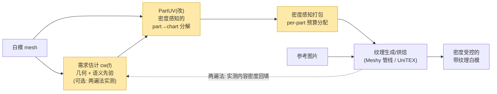

# 04 · 基于 PartUV 的研究切入点：per-part 纹理密度分配

> 你的设想：**PartUV 已经能很好地把每个 part 分解到 UV space；下一步创新点是不是
> 用每个 part 自己的纹理密度，进一步调整各 part 在 UV space 上的大小——
> 细节多的 part 需要更多 texel？**
> 结论先行：**这个切入点成立，而且技术上和 PartUV 是干净的互补关系**；
> 但它有"浅/中/深"三档做法，浅档偏工程、深档才够一篇论文，建议按深度递进。

---

## 1. 为什么 PartUV 恰好是密度控制的正确底座（四个技术理由）

### 1.1 τ 失真上界 ⇒ chart 内密度近似恒定 ⇒ 每 chart 一个标量就能精确控密

PartUV 保证每个 chart 的面积拉伸失真 ≤ τ（默认 1.25，公式见论文式 (3)(4)——
它度量的恰是"面片 UV/3D 面积比 相对于 chart 整体面积比"的偏离）。这意味着：

> **chart 内部的 TD 波动被 τ 界住（≲ ±25%）**。于是"控制整个模型的密度分布"
> 退化成"给每个 chart 定一个缩放标量"——一个低维、刚性、不会引入新失真的问题。

对比：在 xatlas 的碎片图集（几百上千 chart，失真无界）上做同样的事，chart 内
密度本身就失控，标量缩放控不准。**PartUV 把"密度可控性"从不可能变成了良定义。**
可以写出一个干净的误差分解：

```
全局 TD 偏差 = chart 内偏差（≤ τ，PartUV 负责）
             + part 间分配误差（我们的分配算法负责）
             + 打包取整误差（packer 负责）
```

三项各有其主，正交可控——这是方法论上很漂亮的一点，论文里可以作为 formulation。

### 1.2 part = 密度预算的天然粒度（也是 artist 友好的延续）

- **face 粒度**：连续翘曲，角度失真代价大（你 Exp03/04 已实证，max_anisotropy 161）；
- **chart 粒度**：刚性安全，但语义上没有意义，美术无法按 chart 想问题；
- **part 粒度**：美术的母语——游戏管线本来就按资产/部件定 TD 标准（hero 10.24 px/cm、
  场景 5.12、背景 2.56 这类惯例）。PartUV 的 chart 天生按 part 分组，
  **"per-part 密度预算"第一次有了可交互的载体**。

这直接延续了你判断的 leader 初心：PartUV 让 UV 可读，密度层让像素预算可指定、可审计。

### 1.3 PartUV 把 packing 层留白了 ⇒ 我们的增量不与它相撞

论文 3.5 节明确说"方法与各种现有打包算法完全兼容"，其贡献止步于
chart 分解 + 参数化。**代码核实（详见 05 文档 §3，2026-07-13 实测修正）**：
pip API 的 per-chart UV 归一到 unit square（chart 间尺度未定义，实测离散 318×）；
官方文件路径（`save_results` 导出 + blender 打包）则在导出时按 3D 面积等比缩放，
实测打包后 TD CVw≈0.05–0.08——**L1 均匀是隐式固定行为**。但 config 无任何
density/scale 参数、无 per-chart 权重接口、无内容感知——**留白的是密度的显式
控制（L2/L3）**，我们可以直接消费其输出 + part 分组信息。（碰撞风险见 §5。）

### 1.4 多图集打包 ⇒ 密度控制的"量化档位"版，产品上最好落地

PartUV 支持按 part 分组打到多个图集。给不同图集配**不同分辨率**
（如 head 图集 2048²、body 1024²、底面 512²），就是一种粗粒度但引擎极友好的
密度控制——不改任何布局算法、mip/streaming 天然兼容。这可以作为
论文的一个应用展示，也是最快能进产品的形态。

## 2. 你的设想的三档深度（建议的推进顺序）

### 档 A（浅，≈工程）：PartUV 原样 + 密度感知打包

分解、参数化全部不动；打包时把 part m 的所有 chart 按需求缩放：

```
demand_m = Σ_{f∈P_m} area3d(f) · cw(f)^γ        (cw=1 ⇒ 退化为 uniform TD)
scale_m  ∝ sqrt( demand_m / Σ_{f∈P_m} area3d(f) )
```

然后重打包。这就是把你 `whitemodel.py` 的 `density_layout()` 从 xatlas chart
粒度移植到 PartUV part 粒度。**价值**：一两周内可出 demo、可当 baseline；
**局限**：分配档位受制于既有 chart 划分，需求悬殊时打包效率会塌
（你 `recommended_config.json` 里 `atlas_utilization: 0.18` 就是前车之鉴），
单独不够一篇论文。

### 档 B（中，方法创新的主体）：密度进入 PartUV 的分解搜索本身

PartUV 的递归树搜索在"每 chart 失真 ≤ τ"约束下最小化 chart 数。两个自然的推广：

1. **内容加权失真度量**：把式 (3)(4) 的 stretch 用内容权重 cw(f) 加权——
   细节多的面片，其拉伸在感知上代价更高，应更早触发细分；大平坦低内容区
   可以容忍更大失真、保持大 chart。等价于**把 τ 变成 per-part / per-region 的
   τ_m**（高密度 part 收紧、低密度 part 放宽）。
2. **密度驱动的细分**：需求高的 part 多切几刀（chart 更小更多），
   换来打包时更灵活的高倍缩放和更低的分配误差；需求低的 part 反之保持极简。
   —— 这正是你 Exp05（chart split 是推荐主方法）在 part 语境下的版本。

**这一档的本质：PartUV 优化 (chart 数, 失真)，我们优化
(chart 数, 失真, 密度分配误差, 打包效率) 的四元权衡**——问题定义本身就是新的。

### 档 C（深，端到端故事）：内容感知需求信号闭环（已决策：不依赖 TDF）

> ✅ 2026-07-13 决策（06 文档）：**本课题不依赖 TDF**。需求信号 cw(f) 改由
> 课题内部自给的三路组合提供，oracle（现有贴图）仅作验证工具：

1. **几何驱动**：曲率/特征密度/法线变化率——白模上直接可算，零依赖；
2. **语义先验**：PartField 特征本身可分类 part（脸/手 > 躯干 > 底面），
   套用业界惯例倍率（面部 2–3× 等，见 02 文档）；
3. **两遍法**（利用参考图但不需要预测模型）：均匀布局 → 粗生成一遍纹理 →
   在表面上实测内容密度 → 按需重排布局 → **重新生成/重烘焙**精细纹理。
   第二遍是重新生成而非 rebake，无信息损失（03 文档 §2.4），代价是约 2× 生成开销
   ——这是不训练任何模型就能把"参考图的内容"接进密度分配的干净路径。



黄色三块 = 本课题（需求估计也归我们）；生成 = 现成管线。
**论文叙事**："AI 纹理生成的清晰度瓶颈不在生成器，而在 UV 布局对像素预算的
错误分配——我们把 texel density 变成 UV 展开的一等公民目标，在 part 粒度上
按几何/语义/实测内容分配预算，同一图集分辨率下生成纹理的有效清晰度显著提升。"
（TDF 若日后成熟，可作为第 4 路信号即插即换，但不是本课题的依赖。）

## 3. 验收与评测设计（把"更合理的 UV mapping"变成可测的数字）

**布局层指标**（你 tdopt 已实现大半）：
- L1：TD 变异系数 CV（目标 < 0.1）；
- L2：corr(TD, demand)、target_err_vs_demand、top-K 高内容区 TD 增益；
- 约束：p95 角度失真、folds=0、packing efficiency ≥ baseline − ε、chart 数不爆炸。

**端到端指标**（新课题的差异化证据，也是说服 leader/审稿人的核心实验）：
> 同一白模 + 同一参考图 + 同一图集分辨率 + 同一生成管线，只换 UV 布局
> （xatlas-uniform / PartUV-uniform / ours-content-aware），比较：
> ① 渲染视角下与参考图的 LPIPS/DISTS；② 高细节区局部锐度（拉普拉斯方差/频谱）；
> ③ 等效省分辨率倍数（ours@1024 ≈ uniform@?）；④ 美术盲测。

**Baseline 组**：Blender Smart UV、xatlas（默认等比打包）、PartUV 原版、
PartUV+档A、完整方法（档B+C）。消融：需求信号来源（oracle / TDF / 几何 / 语义）、
γ、是否密度进搜索、是否多图集。

## 4. 风险与依赖（要在开工前钉死的事实）

| 风险 | 影响 | 对策 |
|---|---|---|
| ~~PartUV 代码未放出~~ **已开源**（github.com/EricWang12/PartUV，pip `partuv`，仅 Linux） | 底座工程风险基本消除；剩余风险转为许可：内嵌 PartField 是 NVIDIA **non-commercial** | 学术实验直接用；产品化需替换 part 分解模块（自训分割/开源替代），提前和 leader 报备 |
| UVPackmaster 商业许可（multi-atlas 路径依赖它） | 打包器不可自由改 ⇒ 密度感知打包受限 | 自研/开源 packer（MaxRects 你已有 pack2）；把"带 per-chart 目标缩放 + 效率下界的打包"本身当一个小贡献点（相对 Liu 2019/TABI 的增量） |
| 需求悬殊 ⇒ 打包效率塌 | atlas_utilization 0.18 的教训 | γ 压缩(≤2)、demand clamp、必要时档 B 细分高需求 part、多图集兜底 |
| ~~TDF 未收敛~~（已决策不依赖 TDF） | —— | 需求信号自给：几何 + 语义先验 + 两遍法；oracle-cw 仅作验证。风险转为：几何/语义信号与真实内容需求的相关性要在实验中验证（两遍法可当上界对照） |
| PartUV 作者/他人抢先做密度 | 新颖性风险 | 正在调研相关工作；即使 chart-scale 一层被做，"密度进分解搜索 + 图片驱动需求 + 端到端生成验证"的组合仍有区分度 |

## 5. 一句话总结

> 你的设想方向正确且与已有资产严丝合缝：**PartUV 管"切得好"（chart 少、失真有界、
> part 对齐），本课题管"分得对"（每个 part 按需求拿到应得的像素预算）+
> "知道该分多少"（几何 + 语义先验 + 两遍法实测，已决策不依赖 TDF）**。
> 按 档A（两周内打通 demo，兼产品 PoC 与论文 baseline）→ 档B（方法创新）→
> 档C（端到端故事）推进；L1 做验收底线、L2 主攻、L3 顺带（06 文档决策记录）。
> Q4–Q8（评测用哪条生成管线、数据集范围、许可合规、图集规格、里程碑）仍待与 leader 对齐。
