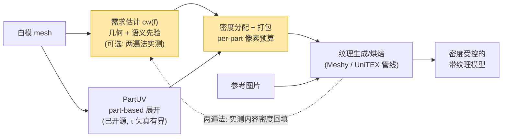

# 纹理密度 × PartUV：研究任务分析与梳理

> 2026-07-13 · 针对 leader 布置的课题「输入图片 + 白模 → 输出满足纹理密度控制的纹理」
> 的系统分析。综合了：PartUV 论文精读（`../paper/`）、你在 `/root/youjiaZhang/纹理密度/`
> 的已有实验（tdopt / relayout / whitemodel, Exp01–06）、TDF 项目
> （`/root/youjiaZhang/UniTEX/`）、leader 给的 4 个 texel density 参考链接、
> 以及对 PartUV 代码生态 / 学术相关工作 / AI texturing 管线 / 业界工具链的
> 多路并行调研（8 个调研线程，来源 URL 均附在各文档内）。

---

## 一页结论（TL;DR）

**你问的三个问题，答案都是肯定的，且比你预想的更扎实：**

1. **"A→按密度重排→B，密度均衡"自洽吗？** 自洽——条件是把密度定义为
   **3D 表面附着量**（你的 tdopt 已满足），此时重排是良定义、幂等、一步收敛的
   预算重分配。但 rebake 不创造信息（A→B 只能"劫富济贫"），所以它的正确角色是
   **验证 oracle**；产品价值在**生成前的白模布局**——恰好就是 leader 的需求场景。
   你的世界地图/人口 cartogram 类比学术史上有对应物（Balmelli, EG 2002 Best Paper），
   但要打补丁：cartogram 须在 chart/part 粒度刚性缩放，不做连续翘曲（角度失真，
   你 Exp03/04 已实证）。→ 详见 **03**

2. **课题本质是"基于纹理密度的 UV mapping 研究"吗？** 是，且可以更精确：
   **把 texel density 从事后度量升级为 UV 布局阶段的一等公民优化目标**；
   管线三段中（展开 / 密度分配+打包 / 纹理生成），研究增量在中段，
   PartUV 是地基，Meshy/UniTEX 生成管线是价值兑现场。密度需求信号
   **已决策不依赖 TDF**：几何 + 语义先验为主信号，两遍法（粗生成→实测→重排→精生成）
   作上界对照。→ 详见 **01**

3. **"用每个 part 的密度调整其 UV 大小"是正确的下一步创新点吗？** 是，且有
   三重佐证：(a) **技术上**，PartUV 的 τ=1.25 失真界让 chart 内 TD 波动 ≤~25%，
   于是 per-part 标量缩放即可精确控密（干净的误差分解）；(b) **文献上**，
   "part-based 展开 × 内容感知密度分配"没有任何已发表工作完整做过，packing 的
   per-chart scale 是"无人认领的自由度"；(c) **代码上**，PartUV 官方仓库默认输出
   连打包都没做（chart 归一到 unit square，"inter-chart arrangement is not yet
   solved"）——密度层是它字面意义上留白的接口。业界侧，±25% 感知容忍度、
   面部 2–3× 等惯例说明非均匀密度是美术手工在做、无人自动化的现有实践。
   → 详见 **04、05、02**

**竞争预警**：腾讯 Hunyuan3D Studio (arXiv 2509.12815) 已在系统论文里出现
"texel density requirements" 字样（仅一句工程描述，无形式化/评测）。
时间窗存在但别浪费。→ 05 §5

**许可预警**：PartUV 主体 Apache-2.0，但内嵌 PartField 是 NVIDIA
non-commercial，multi-atlas 打包依赖付费 UVPackmaster——研究无碍，产品化需替换。
→ 05 §3、06 Q6

## 文档目录

| 文档 | 内容 | 回答的问题 |
|---|---|---|
| [01-研究任务梳理](01-研究任务梳理.md) | leader 需求三段拆解、密度控制三层级（L1 均匀/L2 内容感知/L3 用户可控）、与已有 tdopt/TDF 工作的衔接、chicken-and-egg 时序问题 | 我们到底要做什么 |
| [02-纹理密度基础与业界实践](02-纹理密度基础与业界实践.md) | 定义与公式、业界标准数值表（5.12/10.24/20.48 px/cm、±25% 容忍度…）、工具链能力矩阵、工程基线 vs 研究空白划界 | 4 个参考链接讲了什么 + 工具解决到哪了 |
| [03-密度重分布的自洽性分析](03-密度重分布的自洽性分析.md) | 两种"密度"的辨析、良定义/幂等性论证、信息论边界（rebake ≤ A）、cartogram 类比的修正 | 你的直觉对不对（对） |
| [04-基于PartUV的研究切入点](04-基于PartUV的研究切入点.md) | PartUV 作底座的四个技术理由、浅/中/深三档做法（档A 打包缩放 → 档B 密度进分解搜索 → 档C TDF 端到端）、评测设计、风险表 | 下一步怎么干 |
| [05-相关工作与创新定位](05-相关工作与创新定位.md) | 五条学术线索（Sander 2002 → Knodt TOG 2024）、gap 矩阵、PartUV 代码生态核实、论文 pitch 草稿、竞争预警 | 创新点站不站得住（站得住） |
| [06-待确认问题清单](06-待确认问题清单.md) | 8 个待与 leader 对齐的问题（3 个关键：产出形态 / 控到哪层 / TDF 分工），各附选项与默认倾向 | 开工前要问清什么 |
| [07-原型验证方案](07-原型验证方案.md) | 两段式功能拆解（(1) 生成 + (2) 密度重排）、串联 α/β 的区别、本机 partuv 冒烟测试实录、Phase 0–2 原型计划、codex 概念图评注、**全部实测 caveat 与评审采纳记录** | 原型怎么落地（PartUV 已装通） |
| [08-项目需求与实践全记录](08-项目需求与实践全记录.md) | **汇总入口**：需求与决策、五步管线做法、15 条实测坑清单（含已修复的孪生面 bug）、遗留风险、资产清单、下一步 | 一份读完就能接手 |

## 全局管线图（黄色 = 本课题）

## 已确认决策与下一步

**✅ 已确认（2026-07-13，详见 06 决策记录）**：产品 demo 先行、沉淀成论文；
L1 均匀做验收底线（TD CV < 0.1）、L2 内容/语义感知为主攻、L3 用户可控顺带；
**本课题不依赖 TDF**（需求信号 = 几何 + 语义先验 + 两遍法，oracle 仅作验证）。

1. 里程碑 1（约两周，档 A demo = 产品 PoC + 论文 baseline）：
   `pip install partuv` 跑通官方管线 → 把 `whitemodel.py` 的密度分配层移植到其
   non-packed 输出上（part 粒度）→ 产出 GOOD/BAD 式棋盘格对比 + TD 指标报告；
2. 档 B（密度进分解搜索）与档 C（几何/语义/两遍法需求信号 + 端到端生成评测）
   按 04 文档推进；
3. 剩余待对齐问题 Q4–Q8（评测生成管线、数据集范围、许可合规、图集规格、里程碑
   节奏）见 06 文档。
